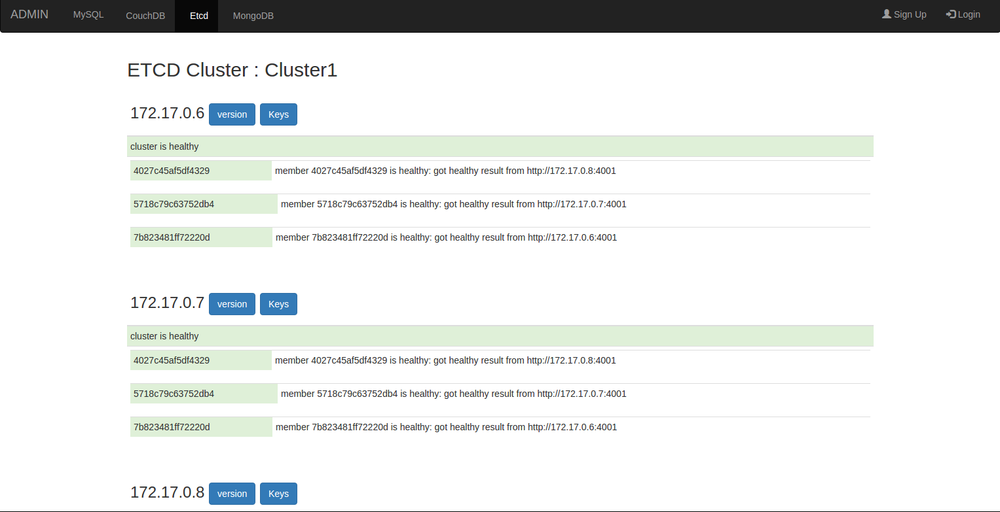
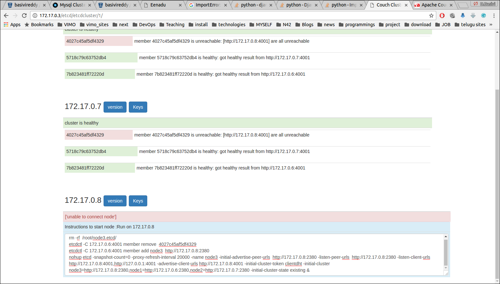
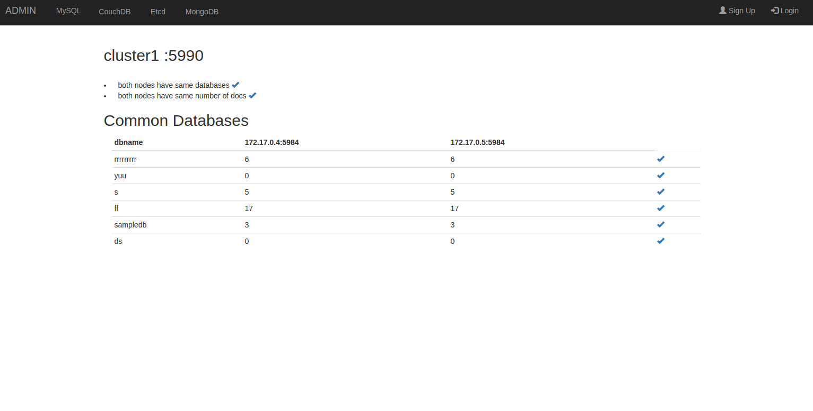
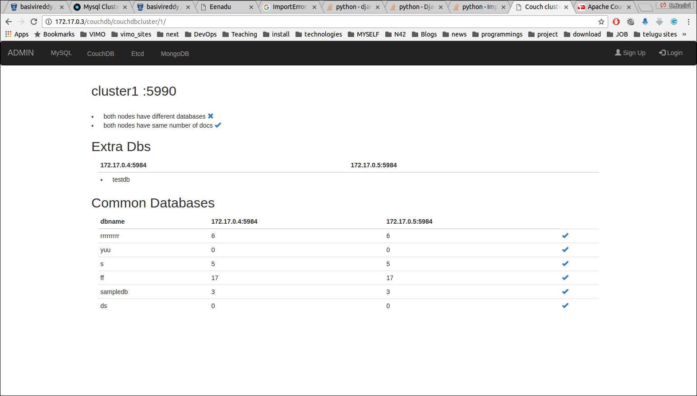
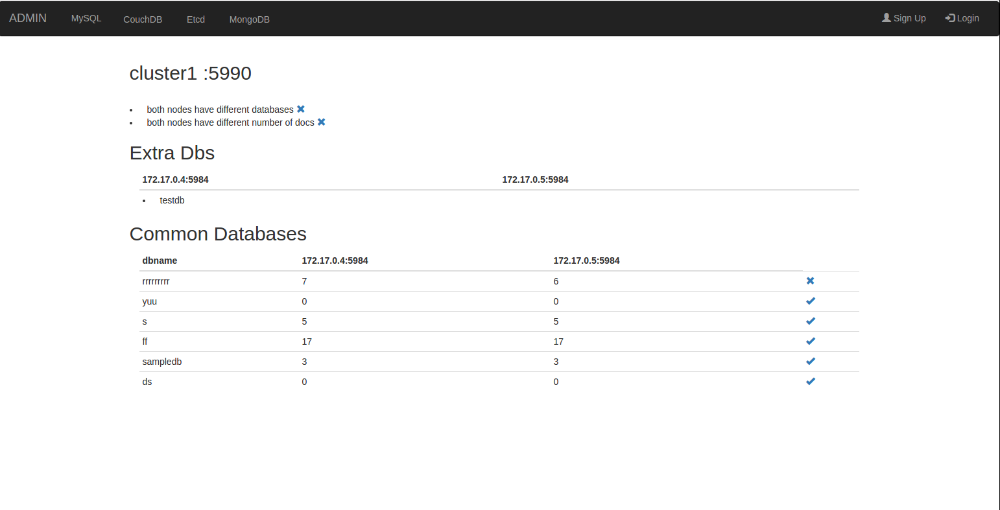
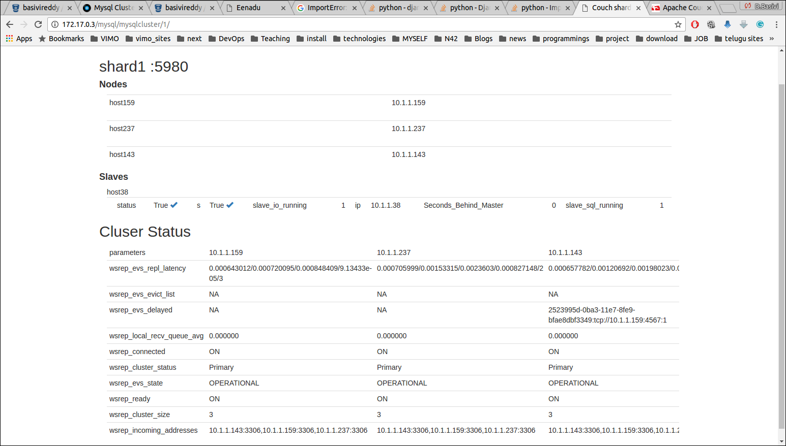

# DBCluster ADMIN
An Administration and Monitoring tool for Etcd, CouchDB, MySQL and MongoDB clusters.

[**Installation Instructions**](#installation) |  [**Docker**](#docker)

------

## ScreenShot: ##
Etcd

When One of Node down

CouchDB

When Cluster have different databases

When Cluster have different databases and different doc's in databases

MongoDB

MySQL

-------

## Docker

```
docker run -it -d --name dbclusteradmin basivireddy/dbclusteradmin:latest
```
 
## Installation

### Create virtual environment and activate(optional)
```
    virtualenv ENV
    source ENV/bin/activate
```

### Download DBClusterADMIN
```
    git clone https://github.com/basivireddy/DBClusterADMIN.git
```

### Install  required packages
```
   apt-get install python-pip
   apt-get install python-dev libmysqlclient-dev
   cd DBClusterADMIN
   pip install -r requirements.txt
```
### Run the server
```
   python manage.py runserver 0.0.0.0:8000
```
then browse ***http://your_server_ip:8000/etcd/***

